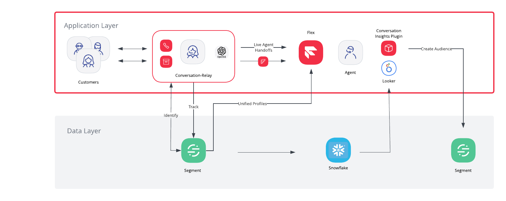

# Conversation Intelligence

This project consists of two main components:
- Conversation Relay - a node server that can handle incoming calls and respond in a conversational way using twilio and generative ai. While conversing with the caller, the server will also generate an intelligent summary, extract key themes, sentiment and other metrics before handing the caller off to a live agent. It can also log all its actions to Coast.io for a compelling live demo.
- Conversation Insights Plugin - a custom Flex plugin that creates a new nav element in Flex where an agent can visualize and analyze dashboards that show the data the conversation relay server has gathered. It also has a recommendation engine that suggests new Segment Audiences to create based on the data, and allows the user to create them.


## Overall Structure


## Running the Components

Conversation Relay Server
1. Navigate to the conversation relay folder:
```bash
cd conversation-relay
```
2. Open the README and follow the steps


Conversation Insights Plugin
1. Navigate to the conversation relay folder:
```bash
cd conversation-insights-plugin
```
2. Open the README and follow the steps
